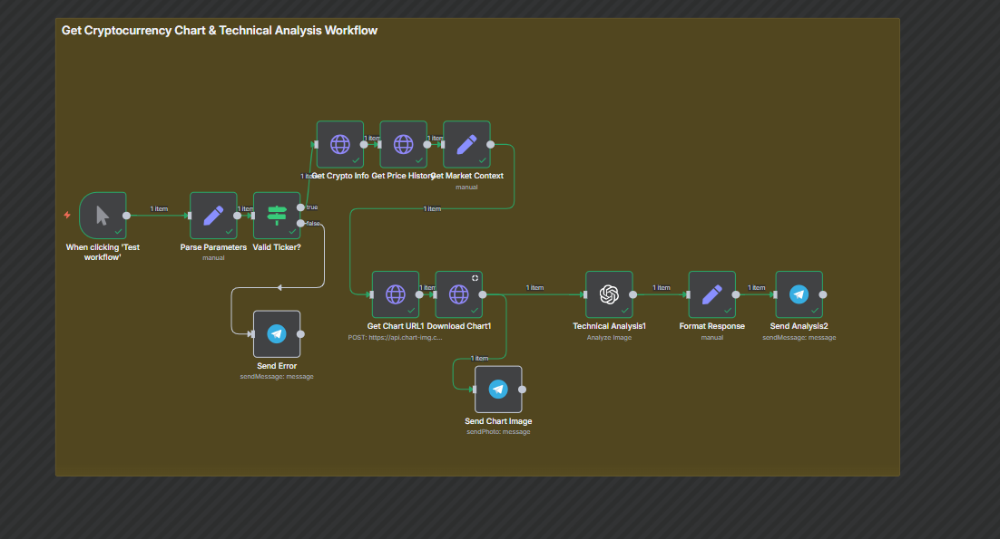
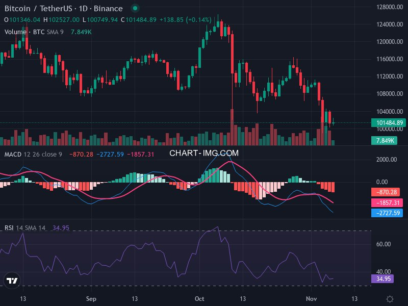

# Cryptocurrency Chart & Technical Analysis Workflow

A comprehensive n8n workflow that automatically generates cryptocurrency charts with technical indicators and AI-powered analysis, delivering results directly to Telegram.

## Workflow Diagram




## Overview

This workflow fetches real-time cryptocurrency data, generates professional trading charts with technical indicators, and performs advanced technical analysis using OpenAI's GPT-4 Vision capability. All results are automatically sent to a specified Telegram chat.

## Features

- **Real-time Data Fetching**: Retrieves cryptocurrency information and price history from CoinGecko API
- **Professional Chart Generation**: Creates trading charts with technical indicators using Chart-img API
- **Technical Indicators**:
  - MACD (Moving Average Convergence Divergence)
  - RSI (Relative Strength Index)
  - Volume Analysis
- **AI-Powered Analysis**: Uses GPT-4 Vision to analyze charts and provide detailed technical insights
- **Telegram Integration**: Sends chart images and analysis reports directly to Telegram
- **Error Handling**: Validates cryptocurrency symbols and handles invalid inputs gracefully
- **Market Context**: Includes current price, market cap, and price change data (24h, 7d, 30d)

## Prerequisites

Before setting up this workflow, ensure you have:

1. **n8n Account**: Access to n8n workflow platform
2. **API Keys**:
   - OpenAI API key (for GPT-4 Vision analysis)
   - Chart-img API key (for chart generation)
   - Telegram Bot Token (from BotFather)
3. **Telegram Setup**:
   - Your Telegram Chat ID
   - A Telegram bot created via BotFather

## Configuration

### Required Credentials

1. **OpenAI Credentials**
   - Navigate to "Credentials" and create OpenAI connection
   - Add your OpenAI API key
  

2. **Telegram Bot Credentials**
   - Create a new Telegram credential
   - Enter your bot token
   

### Workflow Parameters

Update the "Parse Parameters" node with your settings:

| Parameter | Default | Description |
|-----------|---------|-------------|
| `chart-img ApI key` | - | Your Chart-img API key (required) |
| `telegram chatID` | - | Your Telegram Chat ID (required) |
| `ticker` | BTCUSDT | Cryptocurrency trading pair |
| `timeframe` | 1D | Chart timeframe (1D, 4H, 1H, 15m, etc.) |
| `indicator1` | MACD | Primary technical indicator |
| `indicator2` | Relative Strength Index | Secondary technical indicator |
| `theme` | dark | Chart theme (dark/light) |
| `range` | 3M | Historical data range (3M, 1M, 1W, etc.) |
| `exchange` | BINANCE | Trading exchange |
| `baseCoin` | bitcoin | Cryptocurrency name |
| `cryptoId` | bitcoin | CoinGecko API cryptocurrency ID |

## Workflow Steps

1. **When clicking 'Test workflow'**: Manual trigger to start the workflow
2. **Parse Parameters**: Extract and set all configuration parameters
3. **Valid Ticker?**: Validate the cryptocurrency symbol
4. **Get Crypto Info**: Fetch cryptocurrency data from CoinGecko API
5. **Get Price History**: Retrieve 7-day price history data
6. **Get Market Context**: Compile market data and statistics
7. **Get Chart URL1**: Request chart generation from Chart-img API
8. **Download Chart1**: Download the generated chart image
9. **Technical Analysis1**: Analyze chart using GPT-4 Vision
10. **Format Response**: Structure the analysis output
11. **Send Chart Image**: Send chart to Telegram
12. **Send Analysis2**: Send detailed technical analysis to Telegram

## Supported Cryptocurrencies

The workflow supports any cryptocurrency available on CoinGecko. Common examples:

- Bitcoin (BTCUSDT / bitcoin)
- Ethereum (ETHUSDT / ethereum)
- Cardano (ADAUSDT / cardano)
- Solana (SOLUSDT / solana)
- Ripple (XRPUSDT / ripple)

## Output

The workflow sends two messages to Telegram:

1. **Chart Image**: Professional trading chart with technical indicators

## Sample Output



2. **Analysis Report**: Comprehensive technical analysis including:
   - Candlestick pattern analysis
   - MACD indicators interpretation
   - Volume analysis
   - Support and resistance levels
   - RSI conditions
   - Market context and sentiment
   - Actionable insights and trading recommendations
   - Risk assessment

## Error Handling

- **Invalid Ticker**: If an invalid cryptocurrency symbol is provided, an error message is sent to Telegram
- **API Failures**: Failed API requests are logged; ensure all credentials are correctly configured

## Customization

### Change Default Cryptocurrency

Edit the `ticker` and `baseCoin` parameters in the "Parse Parameters" node:

```json
{
  "ticker": "ETHUSDT",
  "baseCoin": "ethereum",
  "cryptoId": "ethereum"
}
```

### Modify Analysis Prompt

The "Technical Analysis1" node contains a detailed system prompt. Customize the analysis instructions by editing the `text` parameter to focus on specific aspects or add additional analysis requirements.

### Add More Indicators

Update the `studies` array in the "Get Chart URL1" node to include additional indicators like Bollinger Bands, Stochastic, or Moving Averages.

## Limitations

- Chart-img API rate limits apply
- CoinGecko API has rate limiting on free tier
- Telegram API rate limiting
- Chart generation may take 5-10 seconds

## Troubleshooting

| Issue | Solution |
|-------|----------|
| "Invalid API key" | Verify chart-img and OpenAI API keys are correct |
| Telegram message not sending | Check Telegram Chat ID and bot token are correct |
| Chart not generating | Ensure ticker format matches `EXCHANGE:SYMBOL` pattern |
| Analysis quality | Increase `maxTokens` in Technical Analysis node |

## License

This workflow is open-source and available under the MIT License.

## Support

For issues or questions:
1. Check the n8n documentation: https://docs.n8n.io/
2. Review API documentation for CoinGecko and Chart-img
3. Verify all credentials and parameters are correctly configured

## Related Resources

- [n8n Documentation](https://docs.n8n.io/)
- [CoinGecko API](https://www.coingecko.com/en/api/documentation)
- [Chart-img API](https://chart-img.com/)
- [OpenAI GPT-4 Vision](https://platform.openai.com/docs/guides/vision)
- [Telegram Bot API](https://core.telegram.org/bots/api)

## Author Notes

This workflow demonstrates advanced n8n capabilities including:
- Multi-API integration
- Image processing with AI/ML
- Real-time data aggregation
- Conditional logic and error handling
- External service automation via webhooks

Perfect for crypto traders, analysts, and automated trading systems.